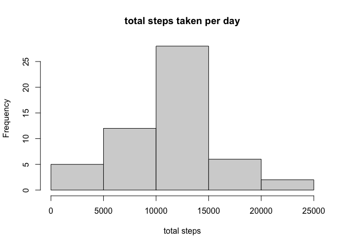
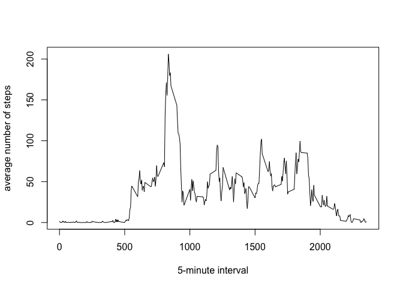
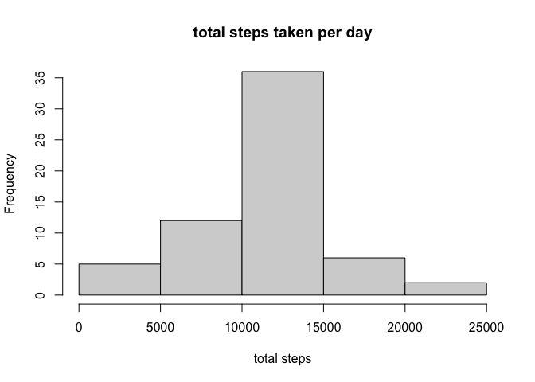
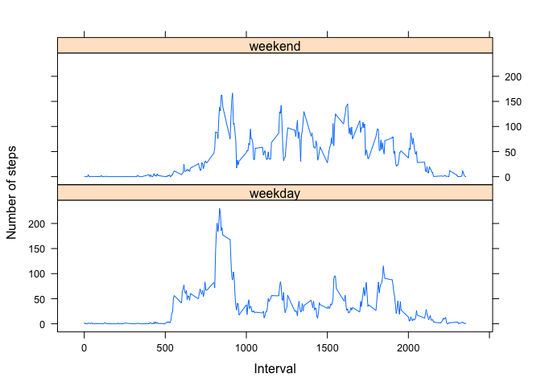

## Loading and preprocessing the data
- Use read.csv to load data and save to a dataframe called "data";  
- Transform date column from character to date type.  

```r
library(dplyr)
```

```
## 
## Attaching package: 'dplyr'
```

```
## The following objects are masked from 'package:stats':
## 
##     filter, lag
```

```
## The following objects are masked from 'package:base':
## 
##     intersect, setdiff, setequal, union
```

```r
data<-read.csv("activity.csv")
data$date<-as.Date(data$date,"%Y-%m-%d")
```

## What is mean total number of steps taken per day?
- Make a histogram of total steps taken per day and calculate the mean and median of total steps per day:

```r
data1<-data%>%group_by(date)%>%summarise(total_step=sum(steps))
```

```
## `summarise()` ungrouping output (override with `.groups` argument)
```

```r
hist(data1$total_step,xlab="total steps",main="total steps taken per day")
```

<!-- -->

```r
step_mean<-mean(data1$total_step,na.rm = TRUE)
step_median<-median(data1$total_step,na.rm = TRUE)
```
- The mean of total steps per day is 1.0766189\times 10^{4}, and the median of total steps per day is 10765.

## What is the average daily activity pattern?
- Make a time series plot of the 5-minute interval (x-axis) and the average number of steps taken, averaged across all days (y-axis):

```r
data2<-data%>%group_by(interval)%>%summarise(average_step=mean(steps,na.rm=TRUE))
```

```
## `summarise()` ungrouping output (override with `.groups` argument)
```

```r
with(data2,plot(interval, average_step,xlab="5-minute interval",ylab="average number of steps",type="l"))
```

<!-- -->

```r
max_interval<-data2$interval[which.max(data2$average_step)]
```
- Time interval 835, average across all the days in the dataset, contains the maximum number of steps.  

## Imputing missing values
The presence of missing data may introduce bias into some calculations or summaries of the data. To address this issue:  
1. Calculate the total number of missing values in the dataset (i.e. the total number of rows with NAs):

```r
MV<-sum(is.na(data$steps))
```
The total number of rows with NAs is 2304.  

2.  Use the mean for the 5-minute interval to fill in the missing values in the dataset.  

3. Create a new dataset that is equal to the original dataset but with the missing data filled in:

```r
NA_id<-which(is.na(data))
for (i in NA_id)
        {
        data$steps[i]=data2$average_step[which(data2$interval==data$interval[i])]
        }
```

4. Make a histogram of the total number of steps taken each day and calculate and report the mean and median total number of steps taken per day:

```r
data3<-data%>%group_by(date)%>%summarise(total_step=sum(steps))
```

```
## `summarise()` ungrouping output (override with `.groups` argument)
```

```r
hist(data3$total_step,xlab="total steps",main="total steps taken per day")
```

<!-- -->

```r
step_mean<-mean(data3$total_step)
step_median<-median(data3$total_step)
```
- The mean of total steps per day is 1.0766189\times 10^{4}, and the median of total steps per day is 1.0766189\times 10^{4}.  
- These values differ slightly from the estimates from the first part of the assignment,but not by much. In this case, the impact of imputing missing data on the estimates of the total daily number of steps is quite minimal, using the 5-minute interval average. In some more complicated cases it might have a different impact.

## Are there differences in activity patterns between weekdays and weekends?
1. Create a new factor variable in the dataset with two levels -- "weekday" and "weekend" indicating whether a given date is a weekday or weekend day:  

```r
data$weekday<-ifelse(weekdays(data$date)=="Saturday"|weekdays(data$date)=="Sunday","weekend","weekday")
data$weekday<-as.factor(data$weekday)
```

2. Make a panel plot containing a time series plot (i.e. type = "l") of the 5-minute interval (x-axis) and the average number of steps taken, averaged across all weekday days or weekend days (y-axis):

```r
library(lattice)
data4<-data%>%group_by(weekday,interval)%>%summarise(average_step=mean(steps))
```

```
## `summarise()` regrouping output by 'weekday' (override with `.groups` argument)
```

```r
xyplot(average_step~interval|weekday,data=data4, type='l',ylab="Number of steps",xlab="Interval",layout=c(1,2))
```

<!-- -->


